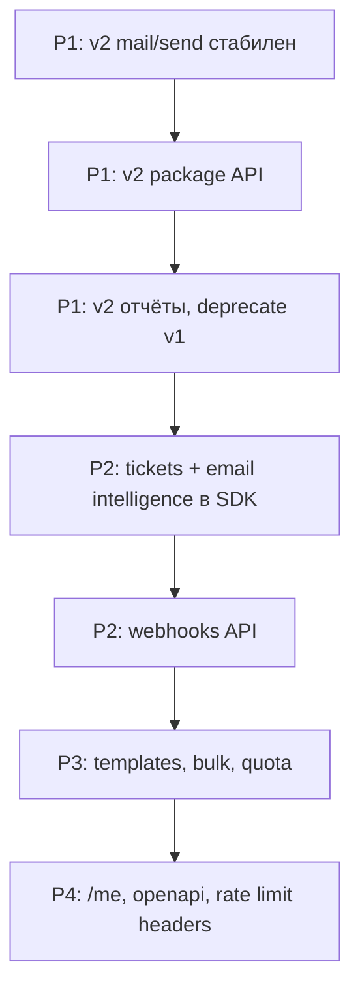

# API Wishlist: СамОтправил HTTP API

Рекомендации по развитию **HTTP API** `api.samotpravil.ru` с точки зрения интеграторов и maintainers `samotpravil-mcp`.

**Источник анализа:** snapshot `data/collection.snapshot.json` (51 HTTP-метод), [Python SDK `samotpravil`](https://pypi.org/project/samotpravil/), покрытие MCP v1.3.2.

**Статус документа:** предложение для команды Samotpravil / Mailganer, не roadmap продукта.

**Связанные материалы:** [ECOSYSTEM.md](./ECOSYSTEM.md) · [EXAMPLES.md](./EXAMPLES.md) · [SWAGGERHUB.md](./SWAGGERHUB.md)

---

## Текущая картина

| Область | Сейчас в docs |
|---------|----------------|
| Единичная отправка | `POST /api/v1/smtp_send` |
| Пакеты | v1: `add_json_package`, XML через `GET add_package` |
| Статусы | `v2/issue/status`, `v2/package/status`, `v2/issue/ext_status` |
| Отчёты | v2 по датам/выпускам + **11 legacy v1** |
| Стоп-листы | v2 (search, export, unsubscribe/fbl/failed lists) |
| WhiteLabel | blist, authkey, ip |
| В docs, не в Python SDK | `tickets`, `emails/clean`, `emails/activity`, `email/check` |
| Deprecated в Postman | `POST /api/v2/mail/send` |

**Главная боль:** v1 и v2 сосуществуют; «современный» контракт не оформлен как единый стабильный v2.

---

## Приоритет 1 — консолидация v2

Цель: один предсказуемый API-слой для новых интеграций, v1 — только с migration guide.

### 1.1 Единичная отправка v2

| | |
|---|---|
| **Сейчас** | `POST /api/v2/mail/send` в папке Deprecated; MCP: `send_mail_v2` |
| **Предложение** | Стабилизировать v2 send, снять deprecated |
| **Контракт** | Паритет с v1: `template_id`, Jinja, tracking, stop-list flags |
| **Ответ** | Единый формат: `message_id`, `x_track_id`, коды ошибок |

**MCP после релиза:** обновить typed tool / Python SDK; auto tool не нужен.

### 1.2 Пакетная отправка v2

| | |
|---|---|
| **Сейчас** | `POST /api/v1/add_json_package`, `GET /api/v1/add_package`, `GET /api/v1/package_stop` |
| **Предложение** | |

```
POST   /api/v2/mail/package           — JSON-пакет (аналог add_json_package)
POST   /api/v2/mail/package/xml       — пакет по URL (вместо GET + query)
POST   /api/v2/mail/package/{id}/stop — остановка
GET    /api/v2/mail/package/{id}      — статус + метаданные
```

**Почему:** REST-семантика (POST для мутаций), единый namespace с `mail/send`.

### 1.3 Отчёты v2 вместо v1

| v1 (legacy) | Предлагаемый v2 |
|-------------|-----------------|
| `GET /api/v1/get_smtp_issue_stat` | `GET /api/v2/issue/statistics/daily` |
| `GET /api/v1/package_report` | `GET /api/v2/package/{id}/report/non-delivery` |
| `GET /api/v1/package_report_fbl` | `GET /api/v2/package/{id}/report/fbl` |
| `GET /api/v1/package_status` | deprecate → `v2/package/status` |
| `GET /api/v1/get_fbl_report` | deprecate → `v2/blist/report/fbl` |
| `GET /api/v1/get_stop_report` | deprecate → `v2/blist/report/non-delivery` |

**Deliverable:** таблица migration v1 → v2 в documenter + sunset-даты.

---

## Приоритет 2 — доработать существующие, но «сырые» методы

### 2.1 Tickets API

| | |
|---|---|
| **Сейчас** | `GET/POST /api/v2/tickets`, `GET/POST /api/v2/tickets/:id/` — есть в snapshot, **нет в Python SDK** |
| **Предложение** | Стабилизировать CRUD тикетов поддержки |
| **Поля** | Связь с `issuen`, `x_track_id`, статусы, вложения |

### 2.2 Email intelligence

| Метод | Назначение |
|-------|------------|
| `POST /api/v2/emails/validate/` | Валидация адреса |
| `POST /api/v2/emails/clean/` | Нормализация |
| `POST /api/v2/emails/activity/` | Проверка активности |
| `POST /api/v2/email/check` | Проверка вёрстки |

**Предложение:** включить в официальный Python SDK; единый формат ответа `{ valid, reason, suggestions }`.

### 2.3 Webhook management

| | |
|---|---|
| **Сейчас** | Webhook через `create_blist` / `update_blist` (WhiteLabel); примеры входящих POST в docs |
| **Предложение** | |

```
GET    /api/v2/webhooks
POST   /api/v2/webhooks
GET    /api/v2/webhooks/{id}
PATCH  /api/v2/webhooks/{id}
DELETE /api/v2/webhooks/{id}
POST   /api/v2/webhooks/{id}/test
```

**События:** `delivered`, `bounced`, `complained`, `unsubscribed` · подпись HMAC-SHA256.

---

## Приоритет 3 — новые возможности для SaaS

### 3.1 Шаблоны писем

В `smtp_send` есть `template_id` (Mailganer), HTTP CRUD шаблонов не описан.

```
GET    /api/v2/templates
POST   /api/v2/templates
GET    /api/v2/templates/{id}
PATCH  /api/v2/templates/{id}
DELETE /api/v2/templates/{id}
POST   /api/v2/templates/{id}/preview
```

### 3.2 Вложения

В XML-пакетах — CID-вложения; upload API не документирован.

```
POST   /api/v2/attachments
GET    /api/v2/attachments/{id}
```

### 3.3 Bulk и квоты

```
POST   /api/v2/issue/status/bulk      — статусы по списку x_track_id / message_id
POST   /api/v2/stop-list/add/bulk   — массовое добавление
GET    /api/v2/quota                  — лимиты, остаток на период
```

### 3.4 API keys (не только WhiteLabel)

```
GET    /api/v2/api-keys
POST   /api/v2/api-keys               — создание, scopes (send/read/admin)
DELETE /api/v2/api-keys/{id}        — ротация / отзыв
```

### 3.5 Unsubscribe management

```
POST   /api/v2/unsubscribe            — программная отписка (GDPR)
GET    /api/v2/unsubscribe/settings   — ссылки, тексты, домены
```

---

## Приоритет 4 — DX и observability

| Эндпоинт | Назначение |
|----------|------------|
| `GET /api/v2/me` | Проверка ключа, account id, plan, blist_id |
| `GET /api/v2/health` | Healthcheck для мониторинга |
| `GET /api/v2/openapi.json` | Живая OpenAPI (не только snapshot в MCP) |
| `GET /api/v2/events` | Единый лог по `x_track_id` (альтернатива цепочке ext_status) |
| Заголовки `X-RateLimit-*` | На всех методах |

---

## Рекомендуемый порядок внедрения



| Фаза | Фокус | Effort |
|------|-------|--------|
| **P1** | v2 send + package + migration v1→v2 | Высокий, критичный для DX |
| **P2** | tickets, validate/clean/activity, webhooks | Средний |
| **P3** | templates, attachments, bulk, quota | Средний |
| **P4** | /me, health, live OpenAPI, rate limits | Низкий |

---

## Связь с MCP и SDK

После появления метода в Postman documenter:

1. `npm run sync-docs` → snapshot
2. Auto tool `api_{method}_{path}` появится автоматически
3. Для частых сценариев — typed tool с именем как в Python SDK (`send_package`, …)
4. Обновить `samotpravil` PyPI и `SDK_TYPED_API_PATHS` в MCP

Шаблон issue для нового MCP tool: [.github/ISSUE_TEMPLATE/new_endpoint.yml](../.github/ISSUE_TEMPLATE/new_endpoint.yml)

---

## Epic issues (для GitHub)

| # | Epic | Label |
|---|------|-------|
| E1 | [API v2: send + package consolidation](./API_WISHLIST.md#приоритет-1--консолидация-v2) | `api`, `v2`, `breaking-change` |
| E2 | [API v2: reports migration, deprecate v1](./API_WISHLIST.md#13-отчёты-v2-вместо-v1) | `api`, `deprecation` |
| E3 | [Stabilize tickets + email intelligence](./API_WISHLIST.md#приоритет-2--доработать-существующие-но-сырые-методы) | `api`, `sdk` |
| E4 | [Webhooks management API](./API_WISHLIST.md#23-webhook-management) | `api`, `webhooks` |
| E5 | [Templates, attachments, bulk, quota](./API_WISHLIST.md#приоритет-3--новые-возможности-для-saas) | `api`, `enhancement` |
| E6 | [DX: /me, health, live OpenAPI, rate limits](./API_WISHLIST.md#приоритет-4--dx-и-observability) | `api`, `dx` |

> Создайте issues в репозитории продукта Samotpravil или перенесите epics в их tracker. В `samotpravil-mcp` — только зеркало для координации с MCP/SDK.

---

## Как предложить изменение

1. Обсудить с support@samotpravil.ru или через [demo](https://samotpravil.ru/demo)
2. После публикации в Postman — PR в `samotpravil-mcp` с `sync-docs` + typed tool при необходимости
3. Issue в этом репо с label `api-wishlist` и ссылкой на секцию этого документа

---

*Последнее обновление: 2026-07-11 · MCP snapshot v1.3.2*
