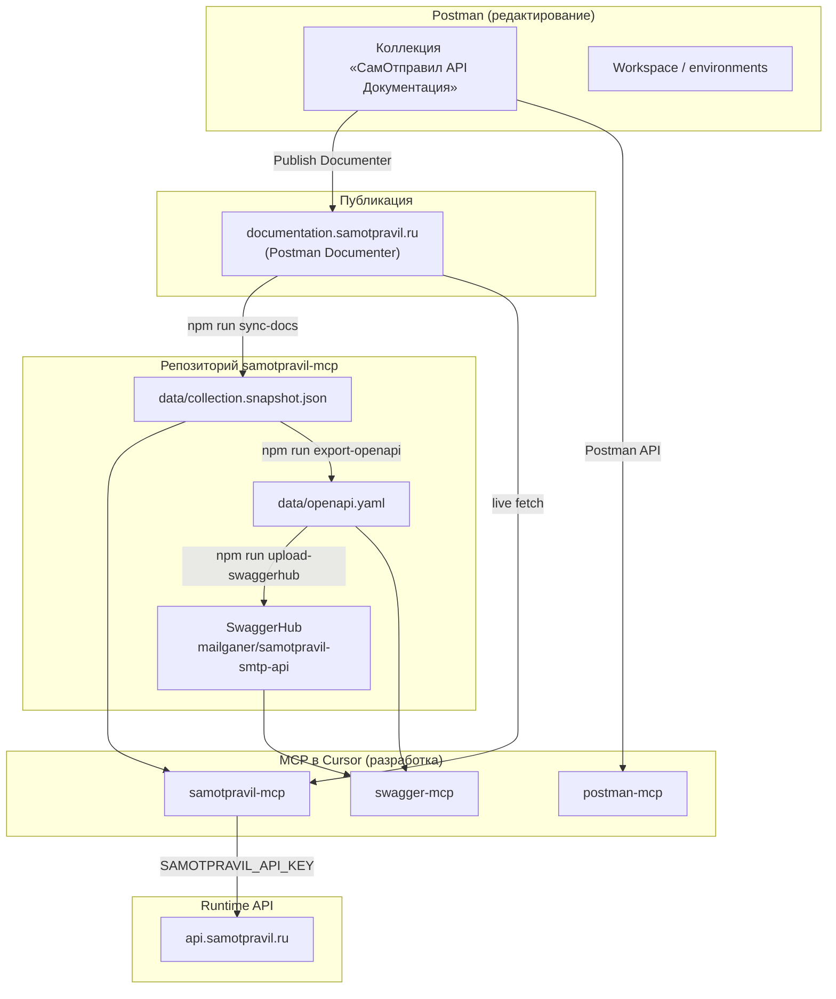

# Экосистема: Postman, Samotpravil MCP и OpenAPI

Как связаны Postman-коллекция, публичная документация, MCP-серверы и OpenAPI в этом репозитории.

**Кратко:** единый источник правды — коллекция **«СамОтправил API Документация»** в Postman workspace Mailganer/Samotpravil. Из неё расходятся documenter, snapshot в репо, `samotpravil-mcp`, OpenAPI и (опционально) Postman MCP.

---

## Схема потоков данных



---

## Источник правды

| Слой | Где | Кто меняет |
|------|-----|------------|
| **Канон** | Postman-коллекция в workspace | Команда документации / API в Postman |
| **Публичный сайт** | [documentation.samotpravil.ru](https://documentation.samotpravil.ru/) | Republish Documenter из Postman |
| **Snapshot в репо** | `data/collection.snapshot.json` | `npm run sync-docs` после публикации documenter |
| **OpenAPI** | `data/openapi.yaml` | `npm run export-openapi` из snapshot |
| **SwaggerHub** | [mailganer/samotpravil-smtp-api](https://app.swaggerhub.com/apis/mailganer/samotpravil-smtp-api/1.0.0) | `npm run upload-swaggerhub` |

`samotpravil-mcp` читает коллекцию так (режим `SAMOTPRAVIL_DOCS_MODE`, default `auto`):

1. **live** — JSON с documenter (`src/docs.ts`, `COLLECTION_URL`)
2. **snapshot** — только `data/collection.snapshot.json` (offline, CI, npm без сети)
3. **auto** — live, при ошибке fallback на snapshot

Подробнее про OpenAPI-пайплайн: **[SWAGGERHUB.md](./SWAGGERHUB.md)**.

---

## Три MCP-сервера в проекте

В локальной разработке (после `./setup.sh`) в `.cursor/mcp.json` обычно три сервера. Это **не дубликаты**, а разные роли.

| MCP | Назначение | Ключ | Когда нужен |
|-----|------------|------|-------------|
| **samotpravil** | Документация API СамОтправил + безопасные вызовы `api.samotpravil.ru` | `SAMOTPRAVIL_API_KEY` (только для API) | **Всегда** — основной сервер для интеграции |
| **postman** | Управление Postman: коллекции, workspace, environments, 100+ generic tools | `POSTMAN_API_KEY` | Когда **редактируете** коллекцию или workspace в Postman |
| **swagger-mcp** | OpenAPI: список эндпоинтов, модели, генерация MCP tool definitions | — (спека из YAML / SwaggerHub) | Когда работаете со **спекой** и codegen из OpenAPI |

### Что даёт только samotpravil-mcp

Postman MCP **не заменяет** эти возможности:

- **Safety** — `SAMOTPRAVIL_READ_ONLY`, `SAMOTPRAVIL_ALLOW_SEND`, `dry_run` (`src/safety.ts`)
- **Typed tools** — `send_email`, `get_delivery_status`, auto-tools из snapshot (`src/registerAutoTools.ts`)
- **MCP Resources** — `samotpravil://overview`, `samotpravil://errors`, … (`src/registerResources.ts`)
- **MCP Prompts** — сценарии отправки, стоп-листа, доставки (`src/registerPrompts.ts`)
- **Работа без Postman** — npm-пользователям достаточно `npx samotpravil-mcp@latest`

### Что даёт только Postman MCP

`samotpravil-mcp` **не умеет**:

- править запросы и описания в коллекции через Postman API
- управлять workspace / environments в аккаунте
- запускать коллекции как тесты в Postman

Поэтому для **maintainer'ов** репозитория Postman MCP — инструмент редактирования канона; для **потребителей API** — опционален.

---

## Ключи и env-файлы

| Файл | Переменные | Для чего |
|------|------------|----------|
| `.env.samotpravil` | `SAMOTPRAVIL_API_KEY`, `SAMOTPRAVIL_READ_ONLY`, … | Вызовы API через samotpravil-mcp |
| `.env.postman` | `POSTMAN_API_KEY`, `POSTMAN_MCP_MODE` | Postman MCP ([шаблон](../.env.postman.example)) |
| `.env.swaggerhub` | `SWAGGERHUB_API_KEY`, `SWAGGERHUB_OWNER`, … | Публикация OpenAPI на SwaggerHub |

Шаблоны: `.env.samotpravil.example`, `.env.postman.example`, `.env.swaggerhub.example`. Все три в `.gitignore`.

Примеры конфигурации MCP: **[EXAMPLES.md](./EXAMPLES.md)**.

---

## Типовые сценарии

### Потребитель API (интегратор)

Достаточно одного MCP:

```json
{ "mcpServers": { "samotpravil": { "command": "npx", "args": ["-y", "samotpravil-mcp@latest"] } } }
```

Postman и swagger-mcp не обязательны.

### Разработчик samotpravil-mcp (этот репозиторий)

```bash
./setup.sh    # .cursor/mcp.json + launchers
```

| Задача | Инструмент |
|--------|------------|
| Найти метод, примеры, ошибки | **samotpravil** (`search_docs`, resources) |
| Отправить тестовый запрос к API | **samotpravil** (`dry_run`, typed tools) |
| Править коллекцию в Postman | **postman** |
| Обновить snapshot после publish documenter | `npm run sync-docs` |
| Пересобрать OpenAPI | `npm run export-openapi` |
| Сгенерировать tool definitions из спеки | **swagger-mcp** |

### Обновление документации end-to-end

1. Изменить коллекцию в **Postman** (или через **postman** MCP).
2. **Publish** → `documentation.samotpravil.ru`.
3. В репозитории:
   ```bash
   npm run sync-docs
   npm run export-openapi
   npm run upload-swaggerhub   # при наличии .env.swaggerhub
   npm test
   ```
4. При необходимости — релиз npm (`samotpravil-mcp`) с новым snapshot.

Чеклист для команды документации: **[official/README.md](./official/README.md)**.

---

## Скрипты и код

| Компонент | Путь | Роль |
|-----------|------|------|
| Загрузка коллекции | `src/docs.ts` | live + snapshot, поиск, форматирование для tools/resources |
| Auto-tools из коллекции | `src/registerAutoTools.ts` | typed HTTP tools по snapshot |
| HTTP-клиент API | `src/client.ts` | `api.samotpravil.ru` |
| Sync snapshot | `scripts/sync-docs.mjs` | documenter → `collection.snapshot.json` |
| OpenAPI export | `scripts/export-openapi.mjs` | snapshot → `openapi.yaml` |
| Swagger-MCP launcher | `scripts/swagger-mcp-launcher.mjs` | OpenAPI → swagger-mcp |
| Postman MCP launcher | `postman-mcp.sh` → `.cursor/postman-mcp.sh` | npx `@postman/postman-mcp-server` |

---

## Почему не один MCP-сервер

Коллекция лежит в Postman, но **слияние samotpravil + postman в один процесс нецелесообразно**:

- у Postman MCP десятки generic tools и отдельный биллинг Postman API;
- у samotpravil-mcp — product-specific safety, resources и npm-пакет без зависимости от Postman-аккаунта;
- swagger-mcp — отдельный upstream ([Vizioz/Swagger-MCP](https://github.com/Vizioz/Swagger-MCP)) для работы со спекой.

Возможное развитие (v1.3+): 2–3 **опциональных** tool'а внутри `samotpravil-mcp` для sync/diff коллекции через Postman API — без подключения полного Postman MCP для конечных пользователей.

---

## См. также

- [EXAMPLES.md](./EXAMPLES.md) — конфигурация MCP, сценарии
- [SWAGGERHUB.md](./SWAGGERHUB.md) — OpenAPI и SwaggerHub
- [official/README.md](./official/README.md) — публикация MCP-блока в documenter
- [CONTRIBUTING.md](../CONTRIBUTING.md) — структура кода
