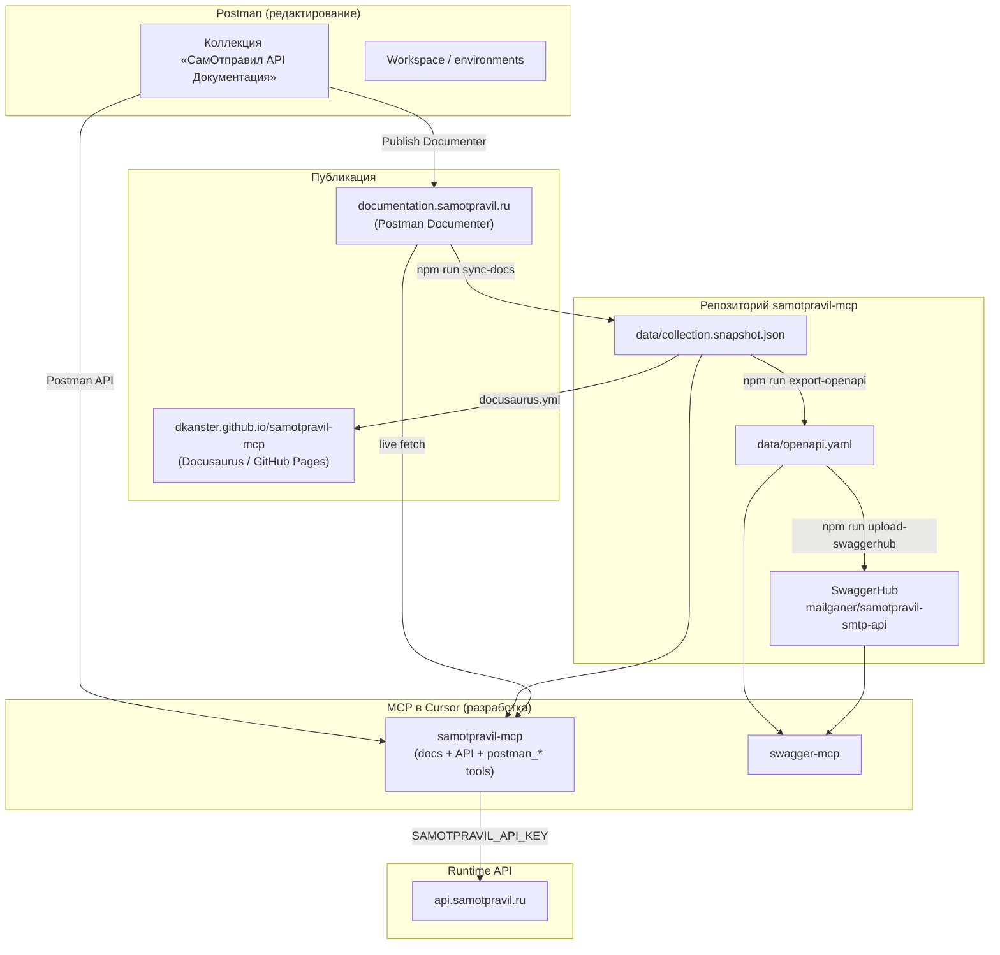

# Экосистема: Postman, Samotpravil MCP и OpenAPI

Как связаны Postman-коллекция, публичная документация, MCP-серверы и OpenAPI в этом репозитории.

**Кратко:** единый источник правды — коллекция **«СамОтправил API Документация»** в Postman workspace Mailganer/Samotpravil. Из неё расходятся documenter, snapshot в репо, `samotpravil-mcp`, OpenAPI и (опционально) swagger-mcp.

---

## Схема потоков данных



---

## Источник правды

| Слой | Где | Кто меняет |
|------|-----|------------|
| **Канон** | Postman-коллекция в workspace | Команда документации / API в Postman |
| **Публичный сайт** | [documentation.samotpravil.ru](https://documentation.samotpravil.ru/) | Republish Documenter из Postman |
| **Preview (Docusaurus)** | [dkanster.github.io/samotpravil-mcp](https://dkanster.github.io/samotpravil-mcp/) | push в `main` → GitHub Actions |
| **Snapshot в репо** | `data/collection.snapshot.json` | `npm run sync-docs` после публикации documenter |
| **OpenAPI** | `data/openapi.yaml` | `npm run export-openapi` из snapshot |
| **SwaggerHub** | [mailganer/samotpravil-smtp-api](https://app.swaggerhub.com/apis/mailganer/samotpravil-smtp-api/1.0.0) | `npm run upload-swaggerhub` |

`samotpravil-mcp` читает коллекцию так (режим `SAMOTPRAVIL_DOCS_MODE`, default `auto`):

1. **live** — JSON с documenter (`src/docs.ts`, `COLLECTION_URL`)
2. **snapshot** — только `data/collection.snapshot.json` (offline, CI, npm без сети)
3. **auto** — live, при ошибке fallback на snapshot

Подробнее про OpenAPI-пайплайн: **[SWAGGERHUB.md](./SWAGGERHUB.md)**.

---

## Два MCP-сервера в проекте

В локальной разработке (после `./setup.sh`) в `.cursor/mcp.json` обычно два сервера. Это **не дубликаты**, а разные роли.

| MCP | Назначение | Ключ | Когда нужен |
|-----|------------|------|-------------|
| **samotpravil** | Документация API + безопасные вызовы `api.samotpravil.ru` + **Postman tools** (`postman_*`) | `SAMOTPRAVIL_API_KEY` (API), `POSTMAN_API_KEY` (Postman) | **Всегда** — основной сервер |
| **swagger-mcp** | OpenAPI: список эндпоинтов, модели, генерация MCP tool definitions | — (спека из YAML / SwaggerHub) | Когда работаете со **спекой** и codegen из OpenAPI |

### Postman tools внутри samotpravil-mcp

При `POSTMAN_API_KEY` доступны tools для управления коллекцией документации:

| Tool | Описание |
|------|----------|
| `postman_get_collection` | Коллекция из Postman API |
| `postman_sync_snapshot` | Postman API → `data/collection.snapshot.json` |
| `postman_diff_snapshot` | Diff Postman vs snapshot |
| `postman_search_requests` | Поиск запросов в коллекции |

Отдельный `@postman/postman-mcp-server` (100+ generic tools) **не обязателен** для документации СамОтправил.

### Возможности samotpravil-mcp

- **Safety** — `SAMOTPRAVIL_READ_ONLY`, `SAMOTPRAVIL_ALLOW_SEND`, `dry_run` (`src/safety.ts`)
- **Typed tools** — `send_email`, `get_delivery_status`, auto-tools из snapshot (`src/registerAutoTools.ts`)
- **MCP Resources** — `samotpravil://overview`, `samotpravil://errors`, … (`src/registerResources.ts`)
- **MCP Prompts** — сценарии отправки, стоп-листа, доставки (`src/registerPrompts.ts`)
- **Работа без Postman** — npm-пользователям достаточно `npx samotpravil-mcp@latest`

### Что не покрывают встроенные postman_* tools

Полный Postman MCP по-прежнему нужен только если требуется:

- управлять workspace / environments в аккаунте
- запускать коллекции как тесты в Postman
- codegen клиента через Postman API (`--code` mode)

Для **maintainer'ов документации** достаточно `postman_*` tools в samotpravil-mcp.

---

## Ключи и env-файлы

| Файл | Переменные | Для чего |
|------|------------|----------|
| `.env.samotpravil` | `SAMOTPRAVIL_API_KEY`, `POSTMAN_API_KEY`, `SAMOTPRAVIL_READ_ONLY`, … | API + Postman tools через samotpravil-mcp |
| `.env.postman` | `POSTMAN_API_KEY` (legacy) | Читается launcher'ом; предпочтительно перенести в `.env.samotpravil` |
| `.env.swaggerhub` | `SWAGGERHUB_API_KEY`, `SWAGGERHUB_OWNER`, … | Публикация OpenAPI на SwaggerHub |

Шаблоны: `.env.samotpravil.example`, `.env.postman.example`, `.env.swaggerhub.example`. Все три в `.gitignore`.

Примеры конфигурации MCP: **[EXAMPLES.md](./EXAMPLES.md)**.

---

## Типовые сценарии

### Потребитель API (интегратор)

Достаточно одного MCP:

```json
{ "mcpServers": { "samotpravil": { "command": "npx", "args": ["-y", "samotpravil-mcp@latest"] } } }
```

Postman и swagger-mcp не обязательны.

### Разработчик samotpravil-mcp (этот репозиторий)

```bash
./setup.sh    # .cursor/mcp.json + launchers
```

| Задача | Инструмент |
|--------|------------|
| Найти метод, примеры, ошибки | **samotpravil** (`search_docs`, resources) |
| Отправить тестовый запрос к API | **samotpravil** (`dry_run`, typed tools) |
| Править коллекцию / синхронизировать snapshot | **samotpravil** (`postman_*` tools) |
| Обновить snapshot после publish documenter | `npm run sync-docs` |
| Пересобрать OpenAPI | `npm run export-openapi` |
| Сгенерировать tool definitions из спеки | **swagger-mcp** |

### Обновление документации end-to-end

1. Изменить коллекцию в **Postman** (или через **postman_*** tools в samotpravil-mcp).
2. **Publish** → `documentation.samotpravil.ru`.
3. В репозитории:
   ```bash
   npm run sync-docs
   npm run export-openapi
   npm run upload-swaggerhub   # при наличии .env.swaggerhub
   git push                    # → автодеплой Docusaurus preview
   npm test
   ```
4. При необходимости — релиз npm (`samotpravil-mcp`) с новым snapshot.

Чеклист для команды документации: **[official/README.md](./official/README.md)**.

---

## Скрипты и код

| Компонент | Путь | Роль |
|-----------|------|------|
| Загрузка коллекции | `src/docs.ts` | live + snapshot, поиск, форматирование для tools/resources |
| Auto-tools из коллекции | `src/registerAutoTools.ts` | typed HTTP tools по snapshot |
| HTTP-клиент API | `src/client.ts` | `api.samotpravil.ru` |
| Postman API client | `src/postman/` | fetch/sync/diff коллекции |
| Sync snapshot (documenter) | `scripts/sync-docs.mjs` | documenter → `collection.snapshot.json` |
| OpenAPI export | `scripts/export-openapi.mjs` | snapshot → `openapi.yaml` |
| Docusaurus content | `scripts/generate-docusaurus-content.mjs` | snapshot → `docusaurus/` |
| Docusaurus deploy | `.github/workflows/docusaurus.yml` | GitHub Pages |
| Swagger-MCP launcher | `scripts/swagger-mcp-launcher.mjs` | OpenAPI → swagger-mcp |

---

## Почему не отдельный Postman MCP

Раньше Postman подключался отдельным MCP-сервером (`@postman/postman-mcp-server`). С **v1.2.1** **Postman tools встроены в samotpravil-mcp**:

- один MCP-сервер для документации и синхронизации коллекции;
- npm-пользователям не нужен Postman-аккаунт (без `POSTMAN_API_KEY` tools просто не регистрируются);
- curated tools (`postman_sync_snapshot`, `postman_diff_snapshot`) вместо 100+ generic Postman API tools.

swagger-mcp остаётся отдельным upstream ([Vizioz/Swagger-MCP](https://github.com/Vizioz/Swagger-MCP)) для работы со спекой.

---

## См. также

- [DOCS_SITE.md](./DOCS_SITE.md) — Docusaurus preview и GitHub Pages
- [EXAMPLES.md](./EXAMPLES.md) — конфигурация MCP, сценарии
- [SWAGGERHUB.md](./SWAGGERHUB.md) — OpenAPI и SwaggerHub
- [official/README.md](./official/README.md) — публикация MCP-блока в documenter
- [CONTRIBUTING.md](../CONTRIBUTING.md) — структура кода
